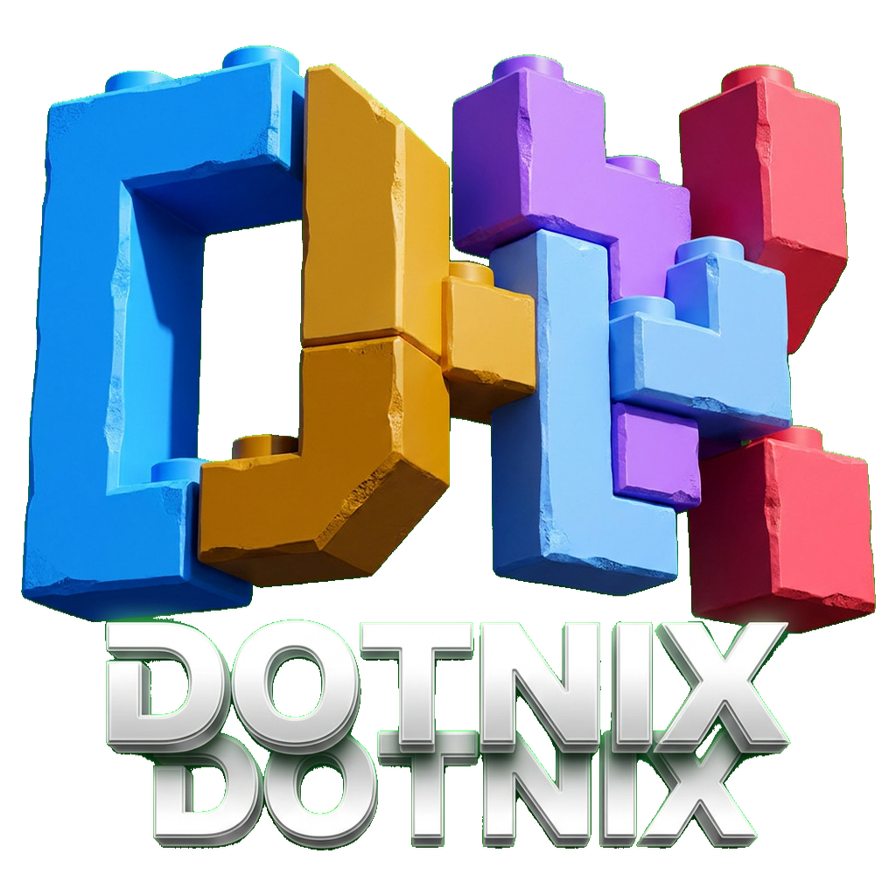

<div align="center">
  

  [](https://github.com/NixOS/nixpkgs/tree/nixos-25.11)
  [](https://github.com/nix-community/home-manager/tree/release-25.11)
  [](LICENSE)

  **❄️ Personal NixOS Home Manager dotfiles — reproducible, declarative, zero drift 🏠**
</div>

---

## Overview

**The Pain:** Keeping your home environment consistent across machines means scattered configs, manual installs, and "works on my machine" drift.

**The Solution:** A Home Manager flake that declares your entire home environment as code — packages, dotfiles, and tool configs all version-controlled in one place.

**The Result:** One command to apply a fully reproducible home setup on any NixOS machine.

## 📦 What's included

- **`flake.nix`** — defines Home Manager outputs under `homeConfigurations`
- **`home/<user>/home.nix`** — per-user package list and dotfile configuration
- **`justfile`** — `switch`, `build`, `show`, and `update` shortcuts

### Currently managed: Codex CLI

`home/liangliangdai/home.nix` installs `pkgs.codex` and writes `~/.codex/config.toml`:

| Setting | Value |
|---------|-------|
| `model` | `gpt-5-codex` |
| `approval_policy` | `on-request` |
| `sandbox_mode` | `workspace-write` |
| `file_opener` | `cursor` |
| `history.persistence` | `save-all` |

## 🚀 Quick Start

**First run** (or when `home-manager` is not yet installed):

```sh
nix run .#home-manager -- switch --flake .#liangliangdai
```

**Subsequent runs** (after activation enables the `home-manager` command):

```sh
home-manager switch --flake .#liangliangdai
```

**Or with `just`:**

```sh
just switch
```

## 🔧 Commands

| Command | Description |
|---------|-------------|
| `just switch` | Apply the configuration |
| `just build` | Build the activation package without switching |
| `just show` | Show flake outputs |
| `just update` | Update flake inputs |

**Build without switching:**

```sh
nix build .#homeConfigurations.liangliangdai.activationPackage
```

## ✅ After activation

Authenticate Codex once:

```sh
codex login
```

> Authentication files are intentionally not managed by this repository.

## 📄 License

MIT — see [LICENSE](LICENSE).
