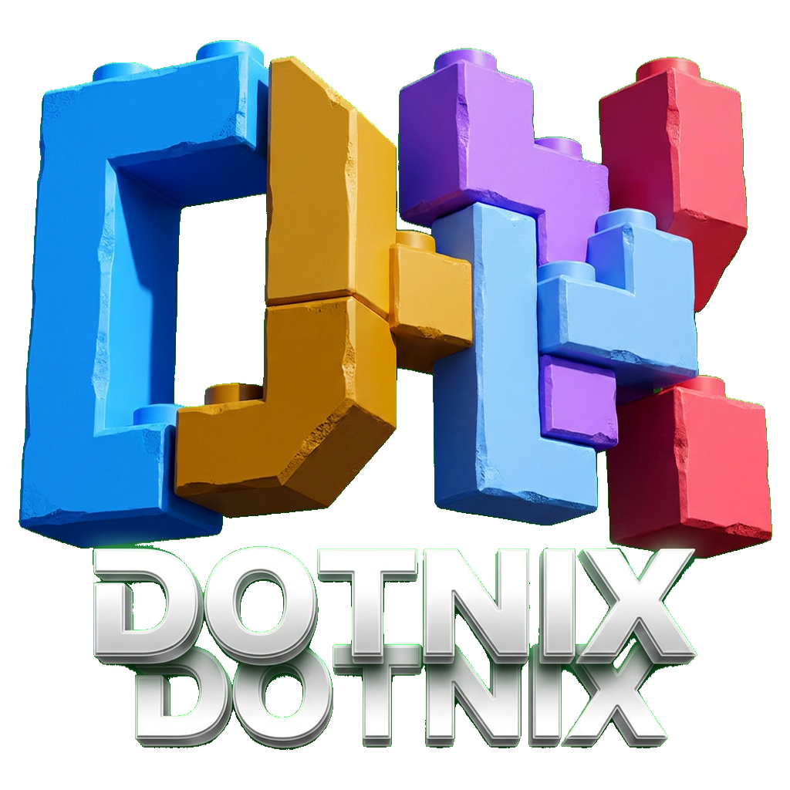

<div align="center">
  

  [](https://github.com/NixOS/nixpkgs/tree/nixos-25.11)
  [](https://github.com/nix-community/home-manager/tree/release-25.11)
  [](LICENSE)

  **Personal Home Manager dotfiles for Linux + macOS — reproducible, declarative, zero drift.**
</div>

---

## 📖 Overview

Keeping a home environment consistent across machines means scattered configs, manual installs,
and "works on my machine" drift. This flake declares the entire home environment as code —
packages, dotfiles, and tool configs all version-controlled in one place — so one command
applies a fully reproducible setup on any supported machine.

## 🖥️ Supported systems

- `x86_64-linux`
- `aarch64-darwin`
- `x86_64-darwin`

## 📦 Managed packages

| Package | Linux | macOS |
|---------|-------|-------|
| [codex](https://github.com/openai/codex) | yes | yes |
| [claude-code](https://github.com/anthropics/claude-code) | yes | yes |
| [asdf](https://asdf-vm.com/) | yes | yes |
| [git](https://git-scm.com/) | yes | yes |
| [gh](https://cli.github.com/) | yes | yes |
| [glab](https://gitlab.com/gitlab-org/cli) | yes | yes |
| [python3](https://www.python.org/) | yes | yes |
| [zellij](https://zellij.dev/) | yes | yes |
| [intellij-idea-ultimate](https://www.jetbrains.com/idea/) | yes | yes |
| [lark-cli](https://www.npmjs.com/package/@larksuite/cli) | yes | yes |
| [browser-use](https://browser-use.com/) | yes | yes |
| [clash-verge-rev](https://www.clashverge.dev/) | yes | yes |
| [google-chrome](https://www.google.com/chrome/) | — | yes |
| [copyq](https://hluk.github.io/CopyQ/) | yes | — |
| [maccy](https://maccy.app/) | — | yes |
| [claude-desktop](https://claude.ai/download) | yes | yes |

Codex config is written to `~/.codex/config.toml` (model `gpt-5-codex`, approval policy `on-request`).

`browser-use` is exposed as a normal command in your profile. During `home-manager switch`,
a pinned upstream installer script is executed automatically and idempotently to provision
`~/.browser-use-env` on first setup (or when the pinned installer hash changes).

### 🐚 Shell integration (zsh)

`~/.zshrc` is managed (`programs.zsh.enable`) so that home-manager's session variables — most
importantly `home.sessionPath`, which puts `~/.asdf/shims` on `PATH` — actually reach a real
terminal. Without this, tools like `npm`/`lark-cli` install fine but come back
`command not found` in an interactive shell. CI verifies this by resolving them through an
interactive `/bin/zsh` on the macOS runner, not just checking the files exist.

First switch on a machine with a hand-written `~/.zshrc`: home-manager refuses to overwrite it,
so move it aside (`mv ~/.zshrc ~/.zshrc.backup`) and fold anything worth keeping into
`programs.zsh.initContent` in `home.nix`.

### 🌐 Faster downloads from mainland China

`scripts/bootstrap-macos.sh` writes `extra-substituters` pointing at the SJTU, TUNA, and USTC
mirrors of `cache.nixos.org` into `/etc/nix/nix.custom.conf` (the Determinate-supported
customization file — hand-editing `/etc/nix/nix.conf` gets reverted, since Determinate's own
tooling manages that file) and restarts the daemon, *before* running the switch. All three are
1:1 mirrors of the official cache (same signing key), so they're only ever an addition:
`cache.nixos.org` stays as the automatic fallback for anything a mirror doesn't have.

System-level config is deliberate: a per-user `~/.config/nix/nix.conf` would only be written at
the *end* of a successful switch (too late for the downloads the switch itself does) and is
silently ignored by the daemon for non-`trusted-users` anyway. The step is idempotent, so
re-running the script on an already-set-up Mac is safe.

On top of that, the Home Manager config manages the substituter *ordering* (mirrors before
`cache.nixos.org`) via `nix.settings.substituters` in the per-user `~/.config/nix/nix.conf`,
since `extra-substituters` can only append after the slow upstream. That per-user override
requires the user to be in `trusted-users` — the bootstrap script ensures this on macOS; on
other machines add `extra-trusted-users = <user>` to the system nix.conf manually, otherwise
the ordering silently falls back to the system default.

To check whether it's actually active, look at Nix's *effective* config rather than guessing:

```sh
nix config show | grep -i substitut
```

### 🧰 Go / Node / Java via asdf, Python via nixpkgs

Go, Node, and Java aren't pinned to whatever nixpkgs ships: `home-manager switch` installs
`asdf` itself, then runs its own activation step (`home.activation.asdfLanguages` in `home.nix`)
that plugs in `golang`, `nodejs`, and `java` (pinned to the [Temurin](https://adoptium.net/)
build, since asdf-java's versions are vendor-prefixed rather than plain semver) and sets each
to whatever asdf resolves as latest. These all install prebuilt binaries — nothing compiles, so
no Xcode Command Line Tools are needed.

This re-checks on every switch, so the active toolchain can move forward silently as upstream
releases land — that's the tradeoff for tracking "latest" instead of a version pinned in this
repo. Each install is best-effort: a network hiccup logs a warning instead of failing the
whole switch.

To pin a specific project to an older version instead of whatever's currently global, add a
`.tool-versions` file in that project (standard asdf behavior, e.g. `nodejs 20.11.0`) — asdf's
shims (already on `PATH` via `home.sessionPath`) pick it up automatically per-directory.

Python deliberately comes from nixpkgs instead (`pkgs.python3`, prebuilt from the cache):
asdf's python plugin compiles CPython from source, which requires Xcode CLT on macOS and takes
minutes, and its "latest" resolution picks the experimental free-threaded `t` variant. To
switch major version, swap `pkgs.python3` for `pkgs.python312`/`python313`/`python314` in
`home.nix` and re-switch; for a one-off shell with a different version,
`nix shell nixpkgs#python312` works without touching the config.

`lark-cli` (the Feishu/Lark CLI, npm `@larksuite/cli`) has no nixpkgs package, so the asdf
activation step installs it globally into the asdf-managed Node and reshims — it surfaces as
`lark-cli` through the same shims directory.

## 🚀 Quick start

```sh
just switch
```

First time (before `home-manager` is on your PATH), bootstrap with:

```sh
# Linux
nix run .#home-manager -- switch --flake .#liangliangdai

# macOS (pick your arch)
nix run .#home-manager -- switch --flake .#liangliangdai-aarch64-darwin
nix run .#home-manager -- switch --flake .#liangliangdai-x86_64-darwin
```

### 🍎 New Mac, zero Nix (or even git) installed

No local clone needed — Nix fetches flakes straight from GitHub via its own
tarball fetcher, `git` CLI not required. `scripts/bootstrap-macos.sh` chains
the two steps: installs Nix (via the
[Determinate Systems installer](https://install.determinate.systems/)) if
it's missing, then applies this flake's Home Manager configuration for your
Mac's architecture directly from `github:NoSugarCoffee/dotnix`.

```sh
curl -fsSL https://raw.githubusercontent.com/NoSugarCoffee/dotnix/main/scripts/bootstrap-macos.sh | bash
```

If Nix wasn't already installed, open a new terminal after the installer
finishes (so `PATH` picks up `nix`) and re-run the same command to apply the
configuration.

Equivalent manual command, if you'd rather not pipe a script into `bash`:

```sh
nix run github:NoSugarCoffee/dotnix#home-manager -- switch --flake github:NoSugarCoffee/dotnix#liangliangdai-aarch64-darwin
```

## 🔧 Commands

| Command | Description |
|---------|-------------|
| `just switch` | Apply the configuration |
| `just generations` | Show all Home Manager generations |
| `just build` | Build without switching |
| `just show` | Show flake outputs |
| `just update` | Update flake inputs |

## 🐚 Dev shell

`just` is available in a repo-local dev shell — no Home Manager needed:

```sh
nix develop
```

## 📄 License

MIT — see [LICENSE](LICENSE).
