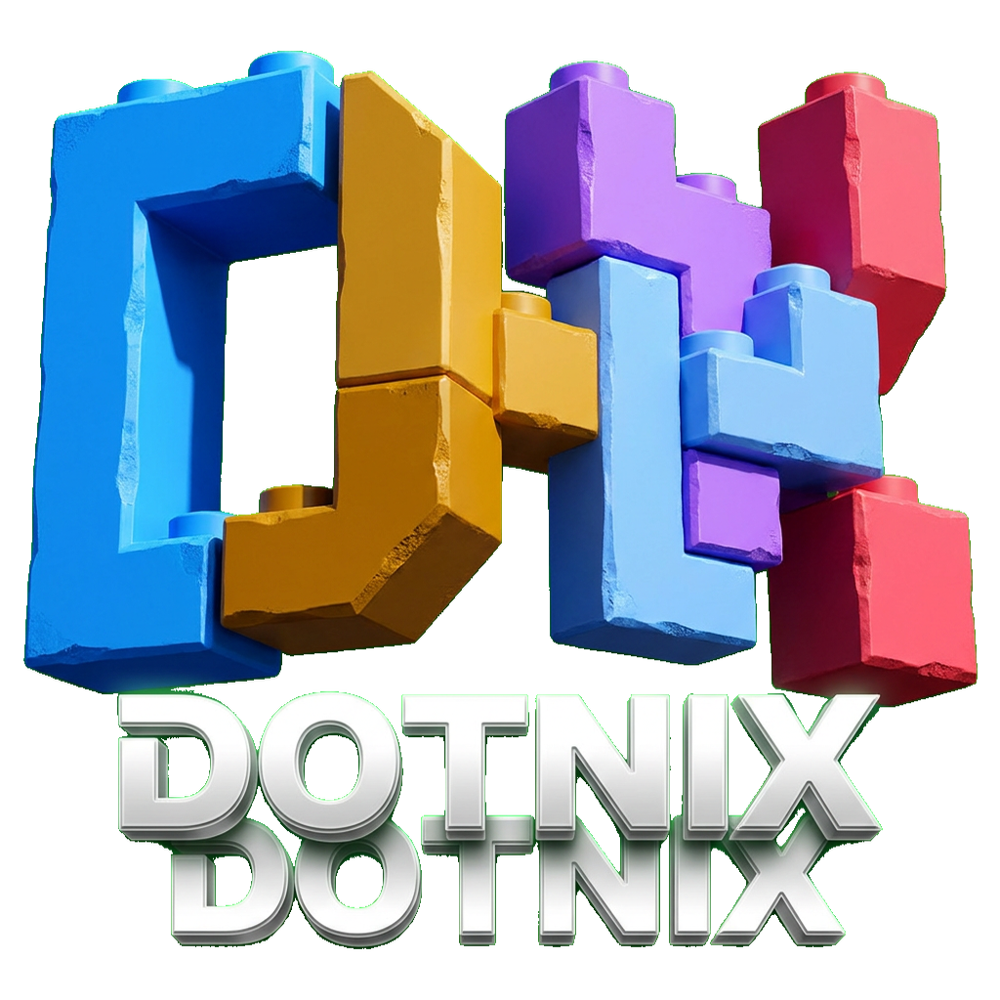

<div align="center">
  

  [](https://github.com/NixOS/nixpkgs/tree/nixos-26.05)
  [](https://github.com/nix-community/home-manager/tree/release-26.05)
  [](LICENSE)

  **Personal Home Manager dotfiles for Linux + macOS — reproducible, declarative, zero drift.**
</div>

---

## 📖 Overview

Keeping a home environment consistent across machines usually means scattered configs, manual
installs, and "works on my machine" drift. This flake declares the entire home environment as
code — packages, dotfiles, and tool configs all version-controlled in one place — so one
command applies a fully reproducible setup on any supported machine.

## 🚀 Quick start

**New machine, no Nix installed** — one-liner that installs Nix (via the
[Determinate installer](https://install.determinate.systems/)) if missing and applies this flake.
No local clone or `git` needed:

```sh
curl -fsSL https://raw.githubusercontent.com/NoSugarCoffee/dotnix/main/scripts/bootstrap-macos.sh | bash
```

If Nix wasn't installed yet, open a new terminal after the installer finishes and re-run.

**Already have Nix, no home-manager yet** — bootstrap the first switch:

```sh
# Linux
nix run .#home-manager -- switch --flake .#liangliangdai

# macOS
nix run .#home-manager -- switch --flake .#liangliangdai-aarch64-darwin
```

**Day to day** — once `just` is on PATH:

```sh
just switch
```

## 📦 Managed packages

| | 🍎 🐧 Both | 🍎 macOS only | 🐧 Linux only |
|---|---|---|---|
| **AI** | [codex](https://github.com/openai/codex) · [claude-code](https://github.com/anthropics/claude-code) · [claude-desktop](https://claude.ai/download) · [pi](https://pi.dev/) · [apm](https://microsoft.github.io/apm/) · [ccstatusline](https://github.com/sirmalloc/ccstatusline) · [paperclip](https://paperclip.ing) · [orca](https://github.com/stablyai/orca) · [agent-access](https://github.com/bitwarden/agent-access) · [bitwarden-cli](https://bitwarden.com/help/cli/) | [ChatGPT](https://learn.chatgpt.com/docs/app) | [grok-bot](https://x.ai/bot) |
| **Terminal** | [kitty](https://sw.kovidgoyal.net/kitty/) · [zellij](https://zellij.dev/) · [zoxide](https://github.com/ajeetdsouza/zoxide) · [yazi](https://github.com/sxyazi/yazi) · [nix-zsh-completions](https://github.com/nix-community/nix-zsh-completions) | — | — |
| **Editors** | [intellij-idea-ultimate](https://www.jetbrains.com/idea/) · [cursor](https://cursor.com/) | [jetbrains-air](https://air.dev/) · [pulsar](https://pulsar-edit.dev/) | — |
| **Dev** | [git](https://git-scm.com/) · [git-open](https://github.com/paulirish/git-open) · [gh](https://cli.github.com/) · [glab](https://gitlab.com/gitlab-org/cli) · [docker](https://www.docker.com/) (client) · [docker-compose](https://docs.docker.com/compose/) · [asdf](https://asdf-vm.com/) (go, nodejs, java, maven) · [pnpm](https://pnpm.io/) · [python3](https://www.python.org/) (ipython, pip) · [just](https://just.systems/) · [lark-cli](https://www.npmjs.com/package/@larksuite/cli) | [colima](https://github.com/abiosoft/colima) | — |
| **Browsers** | — | [google-chrome](https://www.google.com/chrome/) · [ego-lite](https://github.com/citrolabs/ego-lite) | — |
| **Screen** | [obs-studio](https://obsproject.com/) | [macshot](https://github.com/sw33tLie/macshot) | — |
| **Network** | [clash-verge-rev](https://www.clashverge.dev/) | — | — |
| **Utilities** | — | [albert](https://albertlauncher.github.io/) · [maccy](https://maccy.app/) · [scroll-reverser](https://pilotmoon.com/scrollreverser/) · [cida](https://github.com/Xuanwo/cida) | [copyq](https://hluk.github.io/CopyQ/) |

## 🔧 Commands

| Command | Description |
|---------|-------------|
| `just switch` | Apply the configuration |
| `just build` | Build without switching |
| `just generations` | Show Home Manager generations |
| `just update` | Update flake inputs |
| `just show` | Show flake outputs |

## 🍴 Fork

The username is a single source of truth in `flake.nix`:

```nix
let
  username = "liangliangdai";
```

Everything else (`homeConfigurations` attribute names, `home.username`,
`homeDirectory`, CI `USERNAME`, the bootstrap script's flake target)
reads from there directly or via `nix eval --raw .#username`. Fork the
repo and change just that string — that's the whole rebranding step.

## 📝 Notes

- **zsh is managed.** Move an existing `~/.zshrc` aside before the first switch; machine-local config goes in an untracked `~/.zshrc-local`.
- **git config is not.** Per-checkout identity needs `includeIf` paths, so `~/.gitconfig` is hand-written.
- **Codex and Claude Code settings stay writable.** A switch seeds them if missing and resets only the keys declared under `home/codex/` and in `home/claude/settings.nix`.
- **asdf pins Go / Node / Java / Maven** to explicit versions in `home/home.nix`. Python comes from nixpkgs instead, since asdf compiles it from source.
- **Docker on macOS is colima.** A launchd agent starts the VM at login; resize it with `colima stop && colima start --cpu 4 --memory 8`. On Linux the daemon is a system service, out of scope here.
- **China mirrors.** `scripts/bootstrap-macos.sh` adds SJTU/TUNA/USTC substituters; check with `nix config show | grep substitut`.

## 📄 License

MIT — see [LICENSE](LICENSE).
